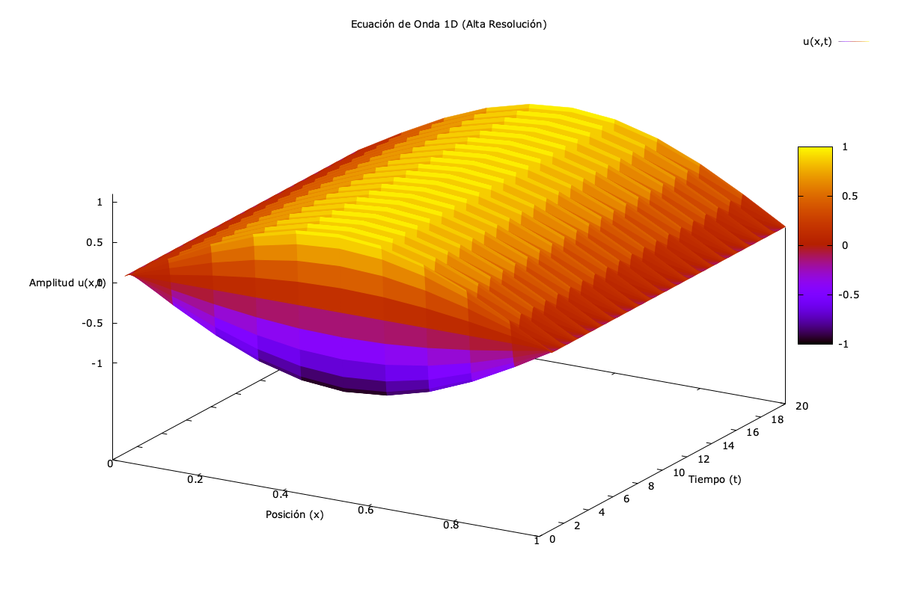

# 1D Wave Equation Solver (Fortran + OpenMP)


Este repositorio contiene una implementación numérica de alto rendimiento para resolver la ecuación de onda unidimensional. El proyecto compara una implementación serial clásica contra una paralelizada con **OpenMP**, analizando la estabilidad numérica y el número de Courant (CFL).

## Resultados y Visualización

**Evolución de la Onda (t=0 a t=20)**

*(Visualización generada con Gnuplot mostrando la propagación en el dominio)*

## Resultados de Rendimiento (Benchmark)

Se realizaron pruebas de estrés ("stress testing") con una malla fina para evaluar la escalabilidad del solver.

**Parámetros de la Prueba:**
* **Malla Espacial ($N_x$):** 10,000 puntos ($\Delta x = 10^{-4}$)
* **Pasos de Tiempo ($N_t$):** ~22,000 iteraciones ($\Delta t = 5 \cdot 10^{-5}$)
* **Hardware:** Apple Silicon (8 Hilos)

| Implementación | Hilos (Threads) | Tiempo de Ejecución | Speedup (Aceleración) |
| :--- | :---: | :---: | :---: |
| **Serial** (Base) | 1 | 23.28 s | 1.0x |
| **OpenMP** (Paralelo) | 8 | **1.01 s** | **23.1x** |

> **Análisis Técnico:** Se observa un comportamiento de **Speedup Superlineal**. Esto ocurre porque la descomposición de dominio permite que los sub-arreglos locales de cada hilo encajen eficientemente en la memoria Caché (L1/L2) del procesador, reduciendo drásticamente la latencia de acceso a memoria (RAM) comparado con la versión serial.

## Descripción del Problema

Se resuelve la ecuación diferencial parcial hiperbólica para una cuerda vibrante:

$$\frac{\partial^2 u}{\partial t^2} = c^2 \frac{\partial^2 u}{\partial x^2}$$

### Dominio y Condiciones
* **Espacio-Tiempo:** $x \in [0, 1]$, $t \in [1, 20]$
* **Velocidad de fase:** $c = 2.0$
* **Frontera (Dirichlet Homogéneas):** Los extremos de la cuerda están fijos.
  $$u(0,t) = 0, \quad u(1,t) = 0$$
* **Estado Inicial:**
  * Configuración: $u(x,0) = \sin(\pi x)$
  * Velocidad: $u_t(x,0) = 0$

---

## Fundamentación Numérica

Para resolver la ecuación parcial, utilizamos el **Método de Diferencias Finitas (FDM)** con un esquema explícito centrado de segundo orden.

### 1. Discretización del Dominio
Definimos una malla espacio-temporal donde $u_i^n$ aproxima a $u(x_i, t_n)$:
* $x_i = i \Delta x, \quad i = 0, \dots, N_x$
* $t_n = n \Delta t, \quad n = 0, \dots, N_t$

### 2. Aproximación de Derivadas
Utilizando expansiones de serie de Taylor, aproximamos las segundas derivadas como:

$$\frac{\partial^2 u}{\partial t^2} \approx \frac{u_i^{n+1} - 2u_i^n + u_i^{n-1}}{\Delta t^2} + O(\Delta t^2)$$

$$\frac{\partial^2 u}{\partial x^2} \approx \frac{u_{i+1}^n - 2u_i^n + u_{i-1}^n}{\Delta x^2} + O(\Delta x^2)$$

### 3. El Algoritmo (Stencil)
Sustituyendo en la ecuación de onda y despejando el término futuro $u_i^{n+1}$, obtenemos la fórmula recursiva:

$$u_i^{n+1} = \alpha^2 (u_{i+1}^n + u_{i-1}^n) + 2(1-\alpha^2)u_i^n - u_i^{n-1}$$

Donde $\alpha$ es el **Número de Courant**:
$$\alpha = \frac{c \Delta t}{\Delta x}$$

### Condición de Arranque (t=0)
Dado que el esquema requiere dos pasos de tiempo anteriores ($n$ y $n-1$), el primer paso ($n=1$) es un caso especial. Usamos la condición inicial de velocidad nula $u_t(x,0) = 0$.
Mediante una diferencia centrada imaginaria en $t=0$:
$$u_i^1 = u_i^{-1} \implies u_i^1 = u_i^0 + \frac{1}{2} \alpha^2 (u_{i+1}^0 - 2u_i^0 + u_{i-1}^0)$$
*Esto garantiza una precisión de segundo orden desde el inicio de la simulación.*

---

## Estabilidad de Von Neumann

Para que el esquema explícito sea estable y no diverja numéricamente, debe satisfacer la condición CFL (Courant-Friedrichs-Lewy):

$$C = \left| \frac{c \Delta t}{\Delta x} \right| \leq 1$$

**En esta simulación:**
* $\Delta x = 0.1$
* $\Delta t = 0.05$
* $c = 2.0$

$$CFL_{calc} = \frac{2.0 \cdot 0.05}{0.1} = 1.0$$

> **Nota:** Se opera en el límite de estabilidad marginal. Esto es ideal teóricamente ya que elimina la difusión numérica, aunque en sistemas más complejos suele usarse $C < 1$ por seguridad.

---

##  Estructura del Repositorio

```text
.
├── Makefile             # Orquestador de compilación
├── src/
│   ├── serial/          # Implementación base (Single-thread)
│   └── openmp/          # Implementación paralela (Multi-thread)
├── plot.gnu             # Script de visualización Gnuplot
└── README.md            # Documentación técnica
````

---

##  Requisitos del Sistema

Para compilar y ejecutar este proyecto, necesitas las siguientes herramientas instaladas en tu entorno:

1.  **Compilador de Fortran:** Debe soportar el estándar Fortran 2008 (o superior) y la especificación **OpenMP** para la versión paralela.
    * *Recomendado:* `gfortran` (GNU Fortran).
2.  **GNU Make:** Para automatizar la compilación mediante el `Makefile`.
3.  **Gnuplot:** Para generar las gráficas y visualizar los resultados (`.dat`).

### Guía de Instalación Rápida

####  Linux (Ubuntu/Debian)
```bash
sudo apt update
sudo apt install gfortran make gnuplot
````

####  Linux (Arch Linux / Manjaro)

```bash
sudo pacman -S gcc make gnuplot
```

####  macOS (con Homebrew)

```bash
brew install gcc make gnuplot
```

_> **Nota para macOS:** El paquete `gcc` en Homebrew incluye `gfortran` y las librerías necesarias de OpenMP (`libgomp`)._

#### Windows

Se recomienda utilizar **WSL (Windows Subsystem for Linux)** y seguir las instrucciones de Ubuntu mencionadas arriba.

### Verificación

Puedes verificar que tienes todo listo ejecutando:

```bash
gfortran --version
make --version
gnuplot --version
```


---

##  Instrucciones de Uso

### 1\. Compilación y Ejecución

El `Makefile` gestiona ambas versiones.

  * **Versión Serial:**
    ```bash
    make run_serial
    ```
  * **Versión Paralela (OpenMP):**
    ```bash
    make run_omp
    ```
    *Esta versión detectará automáticamente los núcleos de tu CPU y reportará el tiempo de cómputo (Wall Clock Time).*

### 2\. Visualización

Para generar la superficie 3D de la evolución de la onda:

```bash
gnuplot plot.gnu
```

Se generará el archivo `grafica_onda.png`.

## Limpieza

```bash
make clean
```

---

**Autor:** Alonso Delfino Cervantes Flores
**Licencia:** MIT
